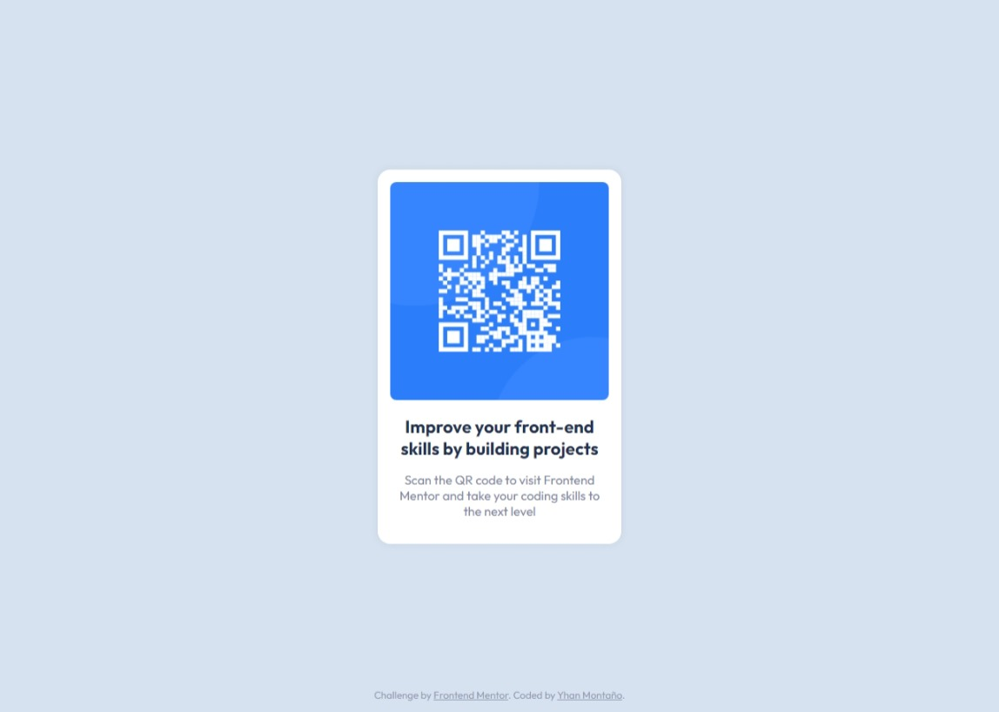

# Frontend Mentor - QR code component solution

This is a solution to the [QR code component challenge on Frontend Mentor](https://www.frontendmentor.io/challenges/qr-code-component-iux_sIO_H). Frontend Mentor challenges help you improve your coding skills by building realistic projects.

## Table of contents

- [Overview](#overview)
  - [Screenshot](#screenshot)
  - [Links](#links)
- [My process](#my-process)
  - [Built with](#built-with)
  - [What I learned](#what-i-learned)
- [Author](#author)

## Overview

### Screenshot

### Links

- Solution URL: https://github.com/XlichOpX/qr-code-component
- Live Site URL: https://brilliant-sundae-31e92b.netlify.app/

## My process

### Built with

- Semantic HTML5 markup
- CSS custom properties
- CSS Grid

### What I learned

How to submit a solution to Frontend Mentor.

## Author

- Website - [Yhan Montaño](https://yhanmontanodev.vercel.app/)
- Frontend Mentor - [@XlichOpX](https://www.frontendmentor.io/profile/XlichOpX)
